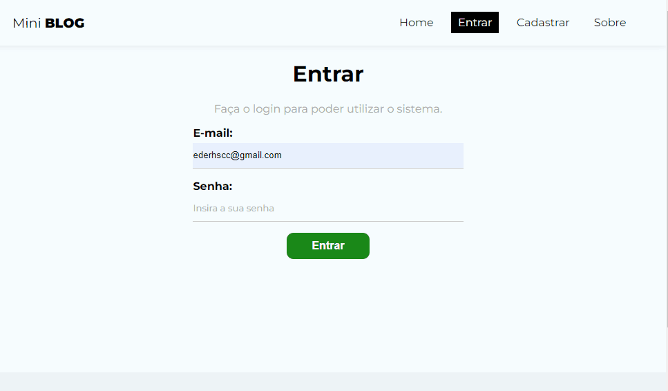

# Projeto MiniBlog com Firebase

## Objetivo

- Construir um mini blog utilizando o Firebase do Google como back-end e o React no front-end. 

<br>

## Índice 📜

#### Screenshot

#### Requisitos do Projeto

#### O Projeto

#### Tecnologias Usadas

#### Como rodar o projeto

<br>

## Screenshot 🎬

<div align='center'>

</div>

<br>

## Requisitos funcionais do Projeto 🧾

- O blog terá uma tela de autenticação por e-mail e senha e uma tela para cadastro de novos usuários;
- Usuários não cadastrados poderão ver uma tela de home com os posts postados, uma tela sobre o MiniBlog e uma tela de cadastros de novos usuários;
- Usuários já cadastrados terão a possibilidade de cadastrar novos posts e poderá gerenciá-los através de uma dashboard que possibilita a edição e exclusão dos mesmos;
- Como back-end o projeto utilizará o Firebase do Google e o React para o front-end, pois todo sistema terá que ser SPA (Single Page Application).

<br>

## O Projeto 📚

Este projeto faz parte do aprendizado em React. Por isso, mais do que uma aplicação Web este MiniBlog foi projetado para colocar em prática os conceitos da biblioteca React como Hooks, Context API, Router entre outros. 

<br>

<br>

## Tecnologias Usadas 🛠

- React;
- React Router;
- Firebase;
- JavaScript;
- Vite;
- CSS.

<br>

## Como rodar o projeto 🎮

Clone o repositório
```bash
git clone https://github.com/ederhscc/miniblog-project
```

 Acesse a pasta do projeto
```bash
cd miniblog-project

```

Instalar as dependências
```bash
npm install
```

Execute a aplicação
```bash
npm run dev
```

<br>

## Autor 🧑

### Eder Henrique Santos

<br>

## Links 🔗

Deploy: 

<div align="left">

  <a href = "mailto:ederhscc@gmail.com" target="_blank">
  
  </a>
  </br>
  <a href="https://www.linkedin.com/in/eder-henrique-santos" target="_blank">
  
  </a>
  </br>

</div>


